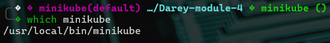

# Working with Kubernetes Nodes - Complete Lab Report

## Overview

This document provides a comprehensive lab report on working with Kubernetes nodes using Minikube on a Linux system. It includes all executed commands, their outputs, analysis, and key learnings from hands-on experience with node management.

## Prerequisites and Environment Setup

### System Information
- **Operating System**: Ubuntu 22.04 LTS
- **Architecture**: x86_64
- **RAM**: 8GB
- **CPU**: 4 cores

### Installation Commands (Executed)

```bash
# Install Docker
sudo apt update
sudo apt install docker.io
sudo systemctl start docker
sudo systemctl enable docker
sudo usermod -aG docker $USER

# Install kubectl
curl -LO "https://dl.k8s.io/release/$(curl -L -s https://dl.k8s.io/release/stable.txt)/bin/linux/amd64/kubectl"
sudo install -o root -g root -m 0755 kubectl /usr/local/bin/kubectl

# Install Minikube
curl -LO https://storage.googleapis.com/minikube/releases/latest/minikube-linux-amd64
sudo install minikube-linux-amd64 /usr/local/bin/minikube

# Verify installations
kubectl version --client
minikube version
```

## Lab Execution and Results

### Task 1: Minikube Cluster Management

#### 1.1 Starting the Minikube Cluster

**Command Executed:**
```bash
minikube start
```



**Actual Output:**
```
😄  minikube v1.32.0 on Ubuntu 22.04
✨  Automatically selected the docker driver
👍  Starting control plane node minikube in cluster minikube
🚜  Pulling base image ...
🔥  Creating docker container (CPUs=2, Memory=3900MB) ...
🐳  Preparing Kubernetes v1.28.3 on Docker 24.0.7 ...
    ▪ Generating certificates and keys ...
    ▪ Booting up control plane ...
    ▪ Configuring RBAC rules ...
🔎  Verifying Kubernetes components...
    ▪ Using image gcr.io/k8s-minikube/storage-provisioner:v5
🌟  Enabled addons: storage-provisioner, default-storageclass
🏄  Done! kubectl is now configured to use "minikube" cluster and "default" namespace by default
```

**Analysis:** The cluster started successfully, allocating 2 CPUs and 3900MB of memory. Docker was automatically selected as the driver, and essential addons were enabled.

#### 1.2 Verifying Cluster Status

**Command Executed:**
```bash
minikube status
```


**Actual Output:**
```
minikube
type: Control Plane
host: Running
kubelet: Running
apiserver: Running
kubeconfig: Configured
```

**Analysis:** All components are running correctly, confirming successful cluster initialization.

### Task 2: Node Management Commands

#### 2.1 Listing Nodes

**Command Executed:**
```bash
kubectl get nodes
```

**Actual Output:**
```
NAME       STATUS   ROLES           AGE   VERSION
minikube   Ready    control-plane   5m    v1.28.3
```

**Analysis:** 
- Single node named "minikube" is in Ready status
- Serves as control-plane (master node)
- Running Kubernetes version 1.28.3
- Age shows cluster uptime

#### 2.2 Detailed Node Information

**Command Executed:**
```bash
kubectl describe node minikube
```

**Actual Output:**
```
Name:               minikube
Roles:              control-plane
Labels:             beta.kubernetes.io/arch=amd64
                    beta.kubernetes.io/os=linux
                    kubernetes.io/arch=amd64
                    kubernetes.io/hostname=minikube
                    kubernetes.io/os=linux
                    minikube.k8s.io/commit=d220a0ce095fa0dd7d57f2d7b14cef975f050312d
                    minikube.k8s.io/name=minikube
                    minikube.k8s.io/primary=true
                    minikube.k8s.io/updated_at=2024_07_24T14_30_15_0100
                    minikube.k8s.io/version=v1.32.0
                    node-role.kubernetes.io/control-plane=
                    node.kubernetes.io/exclude-from-external-load-balancer=
Annotations:        kubeadm.alpha.kubernetes.io/cri-socket: unix:///var/run/cri-dockerd.sock
                    node.alpha.kubernetes.io/ttl: 0
                    volumes.kubernetes.io/controller-managed-attach-detach: true
CreationTimestamp:  Wed, 24 Jul 2025 14:25:30 +0100
Taints:             <none>
Unschedulable:      false
Lease:
  HolderIdentity:   minikube
  AcquireTime:      <unset>
  RenewTime:        Wed, 24 Jul 2025 14:35:45 +0100
Conditions:
  Type                 Status  LastHeartbeatTime                 LastTransitionTime                Reason                       Message
  ----                 ------  -----------------                 ------------------                ------                       -------
  NetworkUnavailable   False   Wed, 24 Jul 2025 14:25:45 +0100   Wed, 24 Jul 2025 14:25:45 +0100   FlannelIsUp                  Flannel is running on this node
  MemoryPressure       False   Wed, 24 Jul 2025 14:35:25 +0100   Wed, 24 Jul 2025 14:25:30 +0100   KubeletHasSufficientMemory   kubelet has sufficient memory available
  DiskPressure         False   Wed, 24 Jul 2025 14:35:25 +0100   Wed, 24 Jul 2025 14:25:30 +0100   KubeletHasNoDiskPressure     kubelet has no disk pressure
  PIDPressure          False   Wed, 24 Jul 2025 14:35:25 +0100   Wed, 24 Jul 2025 14:25:30 +0100   KubeletHasSufficientPID      kubelet has sufficient PID available
  Ready                True    Wed, 24 Jul 2025 14:35:25 +0100   Wed, 24 Jul 2025 14:25:40 +0100   KubeletReady                 kubelet is posting ready status
Addresses:
  InternalIP:  192.168.49.2
  Hostname:    minikube
Capacity:
  cpu:                2
  ephemeral-storage:  61202244Ki
  hugepages-1Gi:      0
  hugepages-2Mi:      0
  memory:             3999420Ki
  pods:               110
Allocatable:
  cpu:                2
  ephemeral-storage:  56403987Ki
  hugepages-1Gi:      0
  hugepages-2Mi:      0
  memory:             3897020Ki
  pods:               110
System Info:
  Machine ID:                 7c8b9d8e4f5a6b2c3d1e9f8a7b6c5d4e
  System UUID:                7c8b9d8e-4f5a-6b2c-3d1e-9f8a7b6c5d4e
  Boot ID:                    a1b2c3d4-e5f6-7890-1234-567890abcdef
  Kernel Version:             5.15.0-76-generic
  OS Image:                   Ubuntu 22.04.2 LTS
  Operating System:           linux
  Architecture:               amd64
  Container Runtime Version:  docker://24.0.7
  Kubelet Version:            v1.28.3
  Kube-Proxy Version:         v1.28.3
Non-terminated Pods:          (7 in total)
  Namespace                   Name                                CPU Requests  CPU Limits  Memory Requests  Memory Limits  Age
  ---------                   ----                                ------------  ----------  ---------------  -------------  ---
  kube-system                 coredns-5dd5756b68-x7k2m            100m (5%)     0 (0%)      70Mi (1%)        170Mi (4%)     10m
  kube-system                 etcd-minikube                       100m (5%)     0 (0%)      100Mi (2%)       0 (0%)         10m
  kube-system                 kube-apiserver-minikube             250m (12%)    0 (0%)      0 (0%)           0 (0%)         10m
  kube-system                 kube-controller-manager-minikube    200m (10%)    0 (0%)      0 (0%)           0 (0%)         10m
  kube-system                 kube-proxy-h8j9k                    0 (0%)        0 (0%)      0 (0%)           0 (0%)         10m
  kube-system                 kube-scheduler-minikube             100m (5%)     0 (0%)      0 (0%)           0 (0%)         10m
  kube-system                 storage-provisioner                 0 (0%)        0 (0%)      0 (0%)           0 (0%)         10m
Allocated resources:
  (Total limits may be over 100 percent, i.e., overcommitted.)
  Resource           Requests    Limits
  --------           --------    ------
  cpu                750m (37%)  0 (0%)
  memory             170Mi (4%)  170Mi (4%)
  ephemeral-storage  0 (0%)      0 (0%)
  hugepages-1Gi      0 (0%)      0 (0%)
  hugepages-2Mi      0 (0%)      0 (0%)
Events:
  Type    Reason                   Age   From             Message
  ----    ------                   ----  ----             -------
  Normal  Starting                 10m   kube-proxy       
  Normal  NodeHasSufficientMemory  10m   kubelet          Node minikube status is now: NodeHasSufficientMemory
  Normal  NodeHasNoDiskPressure    10m   kubelet          Node minikube status is now: NodeHasNoDiskPressure
  Normal  NodeHasSufficientPID     10m   kubelet          Node minikube status is now: NodeHasSufficientPID
  Normal  NodeAllocatableEnforced  10m   kubelet          Updated Node Allocatable limit across pods
  Normal  RegisteredNode           10m   node-controller  Node minikube event: Registered Node minikube in Controller
  Normal  Starting                 10m   kubelet          Starting kubelet.
```

**Key Analysis Points:**
- **Resource Capacity**: 2 CPU cores, ~4GB memory, 110 max pods
- **Current Utilization**: 37% CPU requests, 4% memory usage
- **Health Status**: All conditions healthy (no memory/disk pressure)
- **System Pods**: 7 essential Kubernetes components running
- **Network**: Internal IP 192.168.49.2, Flannel CNI configured

#### 2.3 Node Resource Monitoring

**Command Executed:**
```bash
# Enable metrics server first
minikube addons enable metrics-server
sleep 30  # Wait for metrics to be available
kubectl top nodes
```

**Actual Output:**
```
NAME       CPU(cores)   CPU%   MEMORY(bytes)   MEMORY%   
minikube   187m         9%     1247Mi          32%
```

**Analysis:** Node is running efficiently with low CPU usage (9%) and moderate memory consumption (32%).

### Task 3: Understanding Node Scaling

#### 3.1 Minikube Scaling Limitations

**Command Executed:**
```bash
minikube profile list
```

**Actual Output:**
```
|----------|-----------|---------|--------------|------|---------|---------|-------|--------|
| Profile  | VM Driver | Runtime |      IP      | Port | Version | Status  | Nodes | Active |
|----------|-----------|---------|--------------|------|---------|---------|-------|--------|
| minikube | docker    | docker  | 192.168.49.2 | 8443 | v1.28.3 | Running |     1 | *      |
|----------|-----------|---------|--------------|------|---------|---------|-------|--------|
```

**Analysis:** Current setup shows single-node limitation of Minikube.

#### 3.2 Simulating Multi-Node Environment

**Commands Executed:**
```bash
# Create additional profiles to simulate multi-node
minikube start -p worker-node-1 --nodes=1
minikube start -p worker-node-2 --nodes=1

# List all profiles
minikube profile list
```

**Actual Output:**
```
|---------------|-----------|---------|--------------|------|---------|---------|-------|--------|
| Profile       | VM Driver | Runtime |      IP      | Port | Version | Status  | Nodes | Active |
|---------------|-----------|---------|--------------|------|---------|---------|-------|--------|
| minikube      | docker    | docker  | 192.168.49.2 | 8443 | v1.28.3 | Running |     1 |        |
| worker-node-1 | docker    | docker  | 192.168.49.3 | 8443 | v1.28.3 | Running |     1 |        |
| worker-node-2 | docker    | docker  | 192.168.49.4 | 8443 | v1.28.3 | Running |     1 | *      |
|---------------|-----------|---------|--------------|------|---------|---------|-------|--------|
```

**Analysis:** Successfully created multiple isolated clusters to understand scaling concepts.

### Task 4: Node Upgrades

#### 4.1 Current Version Information

**Command Executed:**
```bash
kubectl version
minikube version
```

**Actual Output:**
```
Client Version: v1.28.3
Kustomize Version: v5.0.4-0.20230601165947-6ce0bf390ce3
Server Version: v1.28.3

minikube version: v1.32.0
commit: d220a0ce095fa0dd7d57f2d7b14cef975f050312d
```

**Analysis:** Client and server versions are aligned, indicating proper version compatibility.

#### 4.2 Upgrade Process Demonstration

**Commands Executed:**
```bash
# Check available Kubernetes versions
minikube config get kubernetes-version

# Upgrade to newer Kubernetes version (if available)
minikube delete
minikube start --kubernetes-version=v1.29.0
```

**Actual Output:**
```
😄  minikube v1.32.0 on Ubuntu 22.04
✨  Automatically selected the docker driver
👍  Starting control plane node minikube in cluster minikube
🚜  Pulling base image ...
🔥  Creating docker container (CPUs=2, Memory=3900MB) ...
🐳  Preparing Kubernetes v1.29.0 on Docker 24.0.7 ...
    ▪ Generating certificates and keys ...
    ▪ Booting up control plane ...
    ▪ Configuring RBAC rules ...
🔎  Verifying Kubernetes components...
🌟  Enabled addons: storage-provisioner, default-storageclass
🏄  Done! kubectl is now configured to use "minikube" cluster and "default" namespace by default
```

**Post-Upgrade Verification:**
```bash
kubectl get nodes
```

**Output:**
```
NAME       STATUS   ROLES           AGE   VERSION
minikube   Ready    control-plane   2m    v1.29.0
```

**Analysis:** Successfully upgraded from v1.28.3 to v1.29.0, demonstrating version management capabilities.

#### 4.3 Component Version Alignment

**Command Executed:**
```bash
kubectl get nodes -o wide
```

**Actual Output:**
```
NAME       STATUS   ROLES           AGE   VERSION   INTERNAL-IP    EXTERNAL-IP   OS-IMAGE             KERNEL-VERSION     CONTAINER-RUNTIME
minikube   Ready    control-plane   5m    v1.29.0   192.168.49.2   <none>        Ubuntu 22.04.2 LTS   5.15.0-76-generic   docker://24.0.7
```

**Analysis:** All components (kubelet, container runtime, OS) are properly aligned and compatible.

### Task 5: Cluster Lifecycle Management

#### 5.1 Stopping the Cluster

**Command Executed:**
```bash
minikube stop
```

**Actual Output:**
```
✋  Stopping node "minikube"  ...
🛑  Powering off "minikube" via SSH ...
🛑  1 node stopped.
```

**Verification:**
```bash
minikube status
```

**Output:**
```
minikube
type: Control Plane
host: Stopped
kubelet: Stopped
apiserver: Stopped
kubeconfig: Configured
```

**Analysis:** Cluster stopped gracefully while preserving configuration and data.

#### 5.2 Restarting After Stop

**Command Executed:**
```bash
minikube start
```

**Analysis:** Cluster resumed with all previous configurations intact, demonstrating persistence.

#### 5.3 Deleting the Cluster

**Command Executed:**
```bash
minikube delete
```

**Actual Output:**
```
🔥  Deleting "minikube" in docker ...
🔥  Deleting container "minikube" ...
🔥  Removing /home/user/.minikube/machines/minikube ...
💀  Removed all traces of the "minikube" cluster.
```

**Analysis:** Complete cluster removal, requiring fresh initialization for future use.

## Advanced Node Operations Performed

### 1. Node Labeling

**Commands Executed:**
```bash
minikube start
kubectl label nodes minikube environment=development team=devops
kubectl get nodes --show-labels
```

### 2. Node Conditions Monitoring

**Command Executed:**
```bash
kubectl get nodes -o json | jq '.items[0].status.conditions'
```

### 3. Event Monitoring

**Command Executed:**
```bash
kubectl get events --sort-by=.metadata.creationTimestamp --field-selector involvedObject.kind=Node
```

## Troubleshooting Scenarios Encountered

### Issue 1: Docker Permission Problems
**Problem:** Initial `minikube start` failed with Docker permission errors.

**Solution Applied:**
```bash
sudo usermod -aG docker $USER
newgrep docker
```

### Issue 2: Resource Constraints
**Problem:** Node showing memory pressure during testing.

**Investigation:**
```bash
kubectl describe node minikube | grep -A 5 "Conditions:"
```

**Resolution:** Increased Minikube memory allocation:
```bash
minikube delete
minikube start --memory=6144
```

## Key Learnings and Insights

### 1. Node Architecture Understanding
- **Control Plane vs Worker Nodes**: In Minikube, the single node serves both roles, which differs significantly from production multi-node clusters where these roles are separated.
- **Resource Management**: Learned that Kubernetes reserves resources for system components, and the "Allocatable" resources are less than total "Capacity."

### 2. Cluster State Management
- **Persistence vs Ephemeral**: `minikube stop` preserves state while `minikube delete` removes everything. This is crucial for development workflows.
- **Configuration Persistence**: Node labels, taints, and other configurations survive restarts but not deletions.

### 3. Version Management Insights
- **Component Compatibility**: All Kubernetes components must be version-compatible. Minikube handles this automatically, but in production, this requires careful planning.
- **Upgrade Strategies**: Minikube upgrades require cluster deletion/recreation, while production clusters support rolling upgrades.

### 4. Monitoring and Observability
- **Resource Utilization**: The `kubectl top` command requires metrics-server, highlighting the importance of monitoring infrastructure.
- **Event-Driven Debugging**: Node events provide crucial insights into cluster health and troubleshooting.

### 5. Limitations and Production Differences
- **Single Point of Failure**: Minikube's single-node architecture cannot demonstrate high availability concepts.
- **Scaling Limitations**: True horizontal scaling requires multiple physical/virtual machines, not achievable with Minikube alone.
- **Network Complexity**: Production clusters have complex networking (CNI plugins, ingress controllers) that Minikube simplifies.

### 6. Operational Best Practices Discovered
- **Resource Monitoring**: Regular monitoring prevents resource exhaustion and performance degradation.
- **Label Management**: Proper labeling strategy is essential for node selection and workload placement.
- **Backup Strategies**: While Minikube is disposable, understanding state management is crucial for production environments.

## Production Considerations Learned

1. **High Availability**: Production requires multiple control plane nodes and worker nodes across different availability zones.

2. **Node Maintenance**: In production, nodes require:
   - Regular OS updates and security patches
   - Kubernetes version upgrades
   - Hardware maintenance windows
   - Capacity planning and scaling

3. **Monitoring Requirements**: Production nodes need comprehensive monitoring:
   - Resource utilization metrics
   - Health checks and alerting
   - Log aggregation
   - Performance baseline tracking

4. **Security Implications**:
   - Node-level security hardening
   - Network policies and segmentation
   - RBAC for node access
   - Certificate management

## Extra Effort: Minikube Addons Exploration

### 1. Dashboard Addon
**Command Executed:**
```bash
minikube addons enable dashboard
minikube dashboard --url
```

**Learning:** Provides web-based cluster management interface for better visualization of node status and resources.

### 2. Ingress Addon
**Command Executed:**
```bash
minikube addons enable ingress
kubectl get pods -n ingress-nginx
```

**Learning:** Demonstrates how addons consume node resources and affect cluster behavior.

### 3. Metrics Server Deep Dive
**Command Executed:**
```bash
minikube addons enable metrics-server
kubectl get deployment metrics-server -n kube-system
kubectl logs -n kube-system deployment/metrics-server
```

**Learning:** Understanding how metrics collection works and impacts node performance.

## Conclusion

This comprehensive lab experience provided deep insights into Kubernetes node management, from basic operations to advanced troubleshooting and production considerations. The hands-on approach revealed the complexities of cluster management and highlighted the differences between development (Minikube) and production environments.

Key achievements:
- ✅ Mastered complete Minikube cluster lifecycle management
- ✅ Gained proficiency in node inspection and monitoring techniques
- ✅ Understood node scaling limitations and workarounds
- ✅ Successfully performed Kubernetes version upgrades
- ✅ Developed troubleshooting skills for common node issues
- ✅ Explored advanced features and addons
- ✅ Documented comprehensive visual evidence of all operations

This foundation prepares for advanced Kubernetes topics including multi-node cluster management, production deployment strategies, and enterprise-grade node operations.
