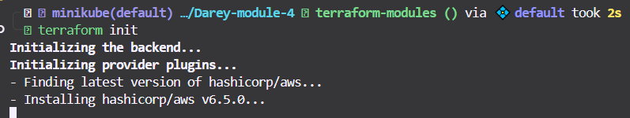
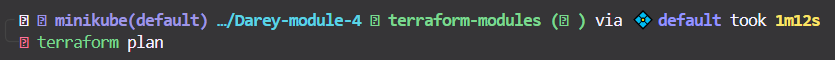
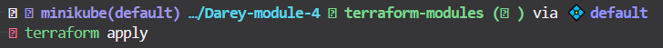

# AWS Terraform ECS Web App Deployment

This project demonstrates how to deploy a dynamic web application on AWS using Terraform modules, Docker containerization, Amazon ECR, and Amazon ECS. The infrastructure is provisioned using modular Terraform configurations for better maintainability and reusability.

## Architecture Overview

The project creates the following AWS resources:
- Amazon ECR repository for storing Docker images
- Amazon ECS cluster for container orchestration
- ECS service and task definitions
- Required IAM roles and security groups
- Load balancer for public access

## Prerequisites

Before starting this project, ensure you have:

- AWS CLI installed and configured with appropriate credentials
- Terraform installed (version 0.12+)
- Docker installed and running
- A dynamic web application ready for containerization

## Project Structure

```
terraform-ecs-webapp/
├── README.md
├── main.tf
├── variables.tf
├── outputs.tf
├── modules/
│   ├── ecr/
│   │   ├── main.tf
│   │   ├── variables.tf
│   │   └── outputs.tf
│   └── ecs/
│       ├── main.tf
│       ├── variables.tf
│       └── outputs.tf
├── app/
│   ├── Dockerfile
│   ├── package.json (or equivalent)
│   └── src/
└── scripts/
    └── deploy.sh
```

## Step-by-Step Implementation

### Step 1: Project Setup

Create the project directory structure:

```bash
mkdir terraform-ecs-webapp
cd terraform-ecs-webapp

# Create module directories
mkdir -p modules/ecr
mkdir -p modules/ecs
mkdir -p app
mkdir -p scripts
```

### Step 2: Create a Dynamic Web Application

For this example, we'll create a simple Node.js application:

**app/package.json**
```json
{
  "name": "webapp",
  "version": "1.0.0",
  "description": "Dynamic web app for ECS deployment",
  "main": "server.js",
  "scripts": {
    "start": "node server.js"
  },
  "dependencies": {
    "express": "^4.18.0"
  }
}
```

**app/server.js**
```javascript
const express = require('express');
const app = express();
const port = process.env.PORT || 3000;

app.get('/', (req, res) => {
  res.json({
    message: 'Hello from containerized web app!',
    timestamp: new Date().toISOString(),
    environment: process.env.NODE_ENV || 'development'
  });
});

app.get('/health', (req, res) => {
  res.status(200).json({ status: 'healthy' });
});

app.listen(port, '0.0.0.0', () => {
  console.log(`Server running on port ${port}`);
});
```

### Step 3: Create Dockerfile

**app/Dockerfile**
```dockerfile
FROM node:16-alpine

WORKDIR /app

COPY package*.json ./
RUN npm install --production

COPY . .

EXPOSE 3000

USER node

CMD ["npm", "start"]
```

### Step 4: Test Docker Container Locally

```bash
cd app
docker build -t webapp:latest .
docker run -p 3000:3000 webapp:latest

# Test the application
curl http://localhost:3000
```

### Step 5: Create ECR Terraform Module

**modules/ecr/variables.tf**
```hcl
variable "repository_name" {
  description = "Name of the ECR repository"
  type        = string
}

variable "image_tag_mutability" {
  description = "Image tag mutability setting"
  type        = string
  default     = "MUTABLE"
}

variable "scan_on_push" {
  description = "Enable image scanning on push"
  type        = bool
  default     = true
}
```

**modules/ecr/main.tf**
```hcl
resource "aws_ecr_repository" "webapp_repo" {
  name                 = var.repository_name
  image_tag_mutability = var.image_tag_mutability

  image_scanning_configuration {
    scan_on_push = var.scan_on_push
  }

  lifecycle {
    prevent_destroy = true
  }
}

resource "aws_ecr_lifecycle_policy" "webapp_repo_policy" {
  repository = aws_ecr_repository.webapp_repo.name

  policy = jsonencode({
    rules = [
      {
        rulePriority = 1
        description  = "Keep last 10 images"
        selection = {
          tagStatus     = "tagged"
          tagPrefixList = ["v"]
          countType     = "imageCountMoreThan"
          countNumber   = 10
        }
        action = {
          type = "expire"
        }
      }
    ]
  })
}
```

**modules/ecr/outputs.tf**
```hcl
output "repository_url" {
  description = "URL of the ECR repository"
  value       = aws_ecr_repository.webapp_repo.repository_url
}

output "repository_arn" {
  description = "ARN of the ECR repository"
  value       = aws_ecr_repository.webapp_repo.arn
}

output "registry_id" {
  description = "Registry ID of the ECR repository"
  value       = aws_ecr_repository.webapp_repo.registry_id
}
```

### Step 6: Create ECS Terraform Module

**modules/ecs/variables.tf**
```hcl
variable "cluster_name" {
  description = "Name of the ECS cluster"
  type        = string
}

variable "service_name" {
  description = "Name of the ECS service"
  type        = string
}

variable "ecr_repository_url" {
  description = "URL of the ECR repository"
  type        = string
}

variable "container_port" {
  description = "Port the container listens on"
  type        = number
  default     = 3000
}

variable "desired_count" {
  description = "Desired number of tasks"
  type        = number
  default     = 2
}

variable "cpu" {
  description = "CPU units for the task"
  type        = number
  default     = 256
}

variable "memory" {
  description = "Memory for the task"
  type        = number
  default     = 512
}
```

**modules/ecs/main.tf**
```hcl
# ECS Cluster
resource "aws_ecs_cluster" "webapp_cluster" {
  name = var.cluster_name

  setting {
    name  = "containerInsights"
    value = "enabled"
  }
}

# Task Definition
resource "aws_ecs_task_definition" "webapp_task" {
  family                   = var.service_name
  network_mode             = "awsvpc"
  requires_compatibilities = ["FARGATE"]
  cpu                      = var.cpu
  memory                   = var.memory
  execution_role_arn       = aws_iam_role.ecs_execution_role.arn

  container_definitions = jsonencode([
    {
      name  = var.service_name
      image = "${var.ecr_repository_url}:latest"
      
      portMappings = [
        {
          containerPort = var.container_port
          hostPort      = var.container_port
          protocol      = "tcp"
        }
      ]

      healthCheck = {
        command = ["CMD-SHELL", "curl -f http://localhost:${var.container_port}/health || exit 1"]
        interval = 30
        timeout = 5
        retries = 3
        startPeriod = 60
      }

      logConfiguration = {
        logDriver = "awslogs"
        options = {
          awslogs-group         = aws_cloudwatch_log_group.webapp_logs.name
          awslogs-region        = data.aws_region.current.name
          awslogs-stream-prefix = "ecs"
        }
      }
    }
  ])
}

# ECS Service
resource "aws_ecs_service" "webapp_service" {
  name            = var.service_name
  cluster         = aws_ecs_cluster.webapp_cluster.id
  task_definition = aws_ecs_task_definition.webapp_task.arn
  desired_count   = var.desired_count
  launch_type     = "FARGATE"

  network_configuration {
    subnets          = data.aws_subnets.default.ids
    security_groups  = [aws_security_group.webapp_sg.id]
    assign_public_ip = true
  }

  load_balancer {
    target_group_arn = aws_lb_target_group.webapp_tg.arn
    container_name   = var.service_name
    container_port   = var.container_port
  }

  depends_on = [aws_lb_listener.webapp_listener]
}

# IAM Roles and Policies
resource "aws_iam_role" "ecs_execution_role" {
  name = "${var.service_name}-ecs-execution-role"

  assume_role_policy = jsonencode({
    Version = "2012-10-17"
    Statement = [
      {
        Action = "sts:AssumeRole"
        Effect = "Allow"
        Principal = {
          Service = "ecs-tasks.amazonaws.com"
        }
      }
    ]
  })
}

resource "aws_iam_role_policy_attachment" "ecs_execution_role_policy" {
  role       = aws_iam_role.ecs_execution_role.name
  policy_arn = "arn:aws:iam::aws:policy/service-role/AmazonECSTaskExecutionRolePolicy"
}

# Security Group
resource "aws_security_group" "webapp_sg" {
  name        = "${var.service_name}-sg"
  description = "Security group for webapp ECS tasks"
  vpc_id      = data.aws_vpc.default.id

  ingress {
    from_port   = var.container_port
    to_port     = var.container_port
    protocol    = "tcp"
    cidr_blocks = ["0.0.0.0/0"]
  }

  egress {
    from_port   = 0
    to_port     = 0
    protocol    = "-1"
    cidr_blocks = ["0.0.0.0/0"]
  }
}

# Application Load Balancer
resource "aws_lb" "webapp_alb" {
  name               = "${var.service_name}-alb"
  internal           = false
  load_balancer_type = "application"
  security_groups    = [aws_security_group.alb_sg.id]
  subnets           = data.aws_subnets.default.ids
}

resource "aws_security_group" "alb_sg" {
  name        = "${var.service_name}-alb-sg"
  description = "Security group for ALB"
  vpc_id      = data.aws_vpc.default.id

  ingress {
    from_port   = 80
    to_port     = 80
    protocol    = "tcp"
    cidr_blocks = ["0.0.0.0/0"]
  }

  egress {
    from_port   = 0
    to_port     = 0
    protocol    = "-1"
    cidr_blocks = ["0.0.0.0/0"]
  }
}

resource "aws_lb_target_group" "webapp_tg" {
  name        = "${var.service_name}-tg"
  port        = var.container_port
  protocol    = "HTTP"
  vpc_id      = data.aws_vpc.default.id
  target_type = "ip"

  health_check {
    path                = "/health"
    healthy_threshold   = 2
    unhealthy_threshold = 10
  }
}

resource "aws_lb_listener" "webapp_listener" {
  load_balancer_arn = aws_lb.webapp_alb.arn
  port              = "80"
  protocol          = "HTTP"

  default_action {
    type             = "forward"
    target_group_arn = aws_lb_target_group.webapp_tg.arn
  }
}

# CloudWatch Log Group
resource "aws_cloudwatch_log_group" "webapp_logs" {
  name              = "/ecs/${var.service_name}"
  retention_in_days = 7
}

# Data Sources
data "aws_region" "current" {}
data "aws_vpc" "default" {
  default = true
}
data "aws_subnets" "default" {
  filter {
    name   = "vpc-id"
    values = [data.aws_vpc.default.id]
  }
}
```

**modules/ecs/outputs.tf**
```hcl
output "cluster_id" {
  description = "ID of the ECS cluster"
  value       = aws_ecs_cluster.webapp_cluster.id
}

output "service_name" {
  description = "Name of the ECS service"
  value       = aws_ecs_service.webapp_service.name
}

output "load_balancer_dns" {
  description = "DNS name of the load balancer"
  value       = aws_lb.webapp_alb.dns_name
}

output "load_balancer_url" {
  description = "URL of the load balancer"
  value       = "http://${aws_lb.webapp_alb.dns_name}"
}
```

### Step 7: Create Main Terraform Configuration

**variables.tf**
```hcl
variable "aws_region" {
  description = "AWS region"
  type        = string
  default     = "us-east-1"
}

variable "project_name" {
  description = "Name of the project"
  type        = string
  default     = "webapp"
}

variable "environment" {
  description = "Environment name"
  type        = string
  default     = "dev"
}
```

**main.tf**
```hcl
terraform {
  required_version = ">= 0.12"
  required_providers {
    aws = {
      source  = "hashicorp/aws"
      version = "~> 5.0"
    }
  }
}

provider "aws" {
  region = var.aws_region
}

locals {
  common_tags = {
    Project     = var.project_name
    Environment = var.environment
    ManagedBy   = "Terraform"
  }
}

module "ecr" {
  source = "./modules/ecr"
  
  repository_name = "${var.project_name}-${var.environment}"
  
  tags = local.common_tags
}

module "ecs" {
  source = "./modules/ecs"
  
  cluster_name        = "${var.project_name}-${var.environment}-cluster"
  service_name        = "${var.project_name}-${var.environment}-service"
  ecr_repository_url  = module.ecr.repository_url
  
  depends_on = [module.ecr]
}
```

**outputs.tf**
```hcl
output "ecr_repository_url" {
  description = "URL of the ECR repository"
  value       = module.ecr.repository_url
}

output "ecs_cluster_id" {
  description = "ID of the ECS cluster"
  value       = module.ecs.cluster_id
}

output "application_url" {
  description = "URL to access the application"
  value       = module.ecs.load_balancer_url
}
```

### Step 8: Create Deployment Script

**scripts/deploy.sh**
```bash
#!/bin/bash

set -e

# Configuration
AWS_REGION="us-east-1"
PROJECT_NAME="webapp"
ENVIRONMENT="dev"
IMAGE_TAG="latest"

echo "Starting deployment process..."

# Initialize Terraform
echo "Initializing Terraform..."
terraform init

# Plan Terraform changes
echo "Planning Terraform changes..."
terraform plan

# Apply Terraform configuration
echo "Applying Terraform configuration..."
terraform apply -auto-approve

# Get ECR repository URL
ECR_REPO_URL=$(terraform output -raw ecr_repository_url)
echo "ECR Repository URL: $ECR_REPO_URL"

# Login to ECR
echo "Logging into ECR..."
aws ecr get-login-password --region $AWS_REGION | docker login --username AWS --password-stdin $ECR_REPO_URL

# Build and tag Docker image
echo "Building Docker image..."
cd app
docker build -t $PROJECT_NAME:$IMAGE_TAG .
docker tag $PROJECT_NAME:$IMAGE_TAG $ECR_REPO_URL:$IMAGE_TAG

# Push image to ECR
echo "Pushing image to ECR..."
docker push $ECR_REPO_URL:$IMAGE_TAG

# Force ECS service update
echo "Updating ECS service..."
aws ecs update-service \
  --cluster ${PROJECT_NAME}-${ENVIRONMENT}-cluster \
  --service ${PROJECT_NAME}-${ENVIRONMENT}-service \
  --force-new-deployment \
  --region $AWS_REGION

echo "Deployment completed successfully!"

# Get application URL
cd ..
APP_URL=$(terraform output -raw application_url)
echo "Application URL: $APP_URL"
echo "Please wait a few minutes for the service to be fully available."
```

### Step 9: Deploy the Infrastructure

Make the deployment script executable and run it:

```bash
chmod +x scripts/deploy.sh
./scripts/deploy.sh
```

Alternatively, deploy manually:

```bash
# Initialize Terraform
terraform init

# Plan the deployment
terraform plan

# Apply the configuration
terraform apply

# Get the ECR repository URL
ECR_REPO_URL=$(terraform output -raw ecr_repository_url)

# Login to ECR
aws ecr get-login-password --region us-east-1 | docker login --username AWS --password-stdin $ECR_REPO_URL

# Build and push Docker image
cd app
docker build -t webapp:latest .
docker tag webapp:latest $ECR_REPO_URL:latest
docker push $ECR_REPO_URL:latest

# Update ECS service to use new image
aws ecs update-service \
  --cluster webapp-dev-cluster \
  --service webapp-dev-service \
  --force-new-deployment \
  --region us-east-1
```

### Step 10: Access and Test the Application

Once deployment is complete, get the application URL:

```bash
terraform output application_url
```

Test the application:

```bash
# Replace with your actual ALB DNS name
curl http://your-alb-dns-name.us-east-1.elb.amazonaws.com/
curl http://your-alb-dns-name.us-east-1.elb.amazonaws.com/health
```

## Monitoring and Troubleshooting

### View ECS Service Status
```bash
aws ecs describe-services \
  --cluster webapp-dev-cluster \
  --services webapp-dev-service
```

### View Application Logs
```bash
aws logs describe-log-streams \
  --log-group-name /ecs/webapp-dev-service
```

### Common Issues and Solutions

1. **Task fails to start**: Check CloudWatch logs for container errors
2. **Service unhealthy**: Verify security group allows traffic on container port
3. **Image pull errors**: Ensure ECR repository exists and image is pushed
4. **Load balancer timeout**: Check health check configuration

## Cleanup

To destroy all resources:

```bash
terraform destroy
```

## Security Considerations

- Use least privilege IAM roles
- Enable VPC flow logs for network monitoring
- Consider using private subnets for ECS tasks
- Implement proper secret management for sensitive data
- Enable AWS Config for compliance monitoring

## Cost Optimization

- Use Fargate Spot for non-critical workloads
- Implement auto-scaling based on metrics
- Set up CloudWatch alarms for cost monitoring
- Use lifecycle policies for ECR repositories

## Next Steps

- Implement CI/CD pipeline with GitHub Actions or AWS CodePipeline
- Add SSL/TLS termination at the load balancer
- Implement blue-green deployments
- Add monitoring and alerting with CloudWatch
- Set up centralized logging with ELK stack or AWS OpenSearch

## Documentation and Observations

Document any challenges faced during implementation:

- Network configuration complexities
- IAM permission requirements
- Container health check tuning
- Load balancer configuration
- Resource sizing and optimization

## Screenshots




This project provides hands-on experience with modern cloud-native application deployment using Infrastructure as Code principles.